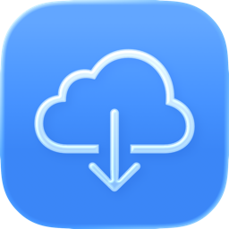

<p align="center">
  
</p>

<h1 align="center">SwiftNZB</h1>

<p align="center">
  A native SwiftUI <b>Usenet NZB downloader</b> for iPhone and iPad.
</p>

Bring your own Usenet server and NZB files; SwiftNZB downloads the article segments over many
parallel TLS connections, decodes yEnc, reassembles the files, verifies/repairs them with PAR2,
extracts RAR archives, and saves the result to the Files app — with a Live Activity showing live
progress on the Lock Screen and in the Dynamic Island.

The app bundles **no indexers and no content**: it's a generic NNTP protocol client that you
point at your own provider.

## Features

- **Fast parallel downloads** — a fixed pool of long-lived, authenticated NNTP connections pulls
  segments from a shared scheduler; the auth handshake is reused across segments.
- **yEnc decode + CRC32 verification** of every article segment.
- **Streaming assembly to disk** — each segment is written at its `=ypart` byte offset into a
  sparse `.part` file, so the scratch file *is* the output; finalize just renames.
- **Resume-safe** — the segment is the atomic, idempotent unit. Checkpoints + positional writes
  mean a dropped connection, a backgrounded app, or a killed process degrades throughput but
  never corrupts state.
- **PAR2 verify + repair** — a clean-room Swift Reed-Solomon implementation (no GPL), so the app
  is App-Store-safe.
- **RAR extraction** via the App-Store-acceptable UnRAR library.
- **Mobile-network resilience** — `NWPathMonitor` parks/resumes on connectivity changes,
  per-request stall timeouts kill half-open cellular sockets, per-segment exponential backoff
  with jitter, and the active-connection count adapts to degraded links.
- **Live Activity** on the Lock Screen and Dynamic Island for the active download.
- **Multiple servers** with a default pick, per-server usage tracking, and connection/bandwidth
  limits (including cellular control).
- **Flexible import** — Files picker, Share sheet / Open-in, drag & drop, and a file-selection
  confirmation step before enqueueing.
- **App Intents & Shortcuts** for automation.
- **iCloud sync** (key-value store) of servers and settings, degrading gracefully to local-only.
- **iPhone + iPad** with an adaptive tab bar / sidebar, and **English + German** localization.

## Screens

Three tabs, each a focused `NavigationStack`:

- **Queue** — active and waiting downloads with live speed/ETA/progress, pause/resume all, and
  drag-to-reorder for queued jobs.
- **History** — completed downloads.
- **Settings** — Servers, Connections, Bandwidth, Post-Processing, Files & Storage, Background,
  and About.

## Architecture

MVVM + `@Observable`. UI and services live in the app target; all the NNTP + decode + PAR2
specifics are isolated in two local Swift packages and surfaced to the UI through the
`DownloadManager` facade.

```
project.yml                  XcodeGen config (SwiftNZB app + SwiftNZBWidgets)
Localizable.xcstrings         String catalog (auto-extracted; en + de)
Packages/DownloadEngine/      NNTP transport, yEnc, CRC32, scheduler, assembler, checkpoints
Packages/PAR2Kit/             Clean-room PAR2 parse / verify / Reed-Solomon repair (no GPL)
SwiftNZB/
  Types/                      Plain Codable models (DownloadActivityAttributes shared to widget)
  Services/                   @Observable @MainActor singletons (DownloadManager, ServerStore, …)
  ViewModels/                 One @Observable view model per screen
  Views/                      Screens + reusable Views/Components/
  Intents/                    App Intents + AppShortcuts
SwiftNZBWidgets/              Live Activity (WidgetKit)
docs/                         AppStoreReview.md, app icon
```

> [!NOTE]
> iOS **cannot** background raw-socket (NNTP) downloads — `URLSession` background mode is
> HTTP-only and `NWConnection` sockets suspend on backgrounding. Large downloads need the app
> foregrounded; background support is best-effort (`beginBackgroundTask` wind-down +
> opportunistic `BGProcessingTask` resume), made safe by checkpoint/resume.

See [`CLAUDE.md`](CLAUDE.md) for the full engineering notes and conventions, and
[`docs/AppStoreReview.md`](docs/AppStoreReview.md) for the App Store strategy.

## Requirements

- iOS 26+, Xcode 26+ (Swift 6, SwiftUI, Observation)
- [XcodeGen](https://github.com/yonaskolb/XcodeGen) (`brew install xcodegen`)
- Ruby + Bundler (for Fastlane)

## Build

The Xcode project is **generated** — edit `project.yml`, never `SwiftNZB.xcodeproj` directly,
and regenerate after adding/removing/renaming files:

```bash
xcodegen generate
xcodebuild -project SwiftNZB.xcodeproj -scheme SwiftNZB \
  -destination 'generic/platform=iOS Simulator' -configuration Debug \
  build CODE_SIGNING_ALLOWED=NO
```

Engine unit tests run without a simulator:

```bash
( cd Packages/DownloadEngine && swift test )
( cd Packages/PAR2Kit && swift test )
```

## Deployment

Signing uses Fastlane **match**. One-time setup: `bundle exec fastlane register_ids`, then
`match development` / `match appstore`.

- **TestFlight** — every push to `main` runs GitHub Actions → `fastlane beta`.
- **App Store** — manually trigger the *release* workflow (or run `fastlane release`) to upload
  the binary + listing metadata. It does **not** auto-submit for review; finish in App Store
  Connect (attach the demo NZB, add screenshots, press Submit).

## License

[MIT](LICENSE). PAR2 verify/repair is a clean-room implementation (no GPL) and RAR extraction
uses the App-Store-acceptable UnRAR library, so the app is safe for public App Store
distribution.
